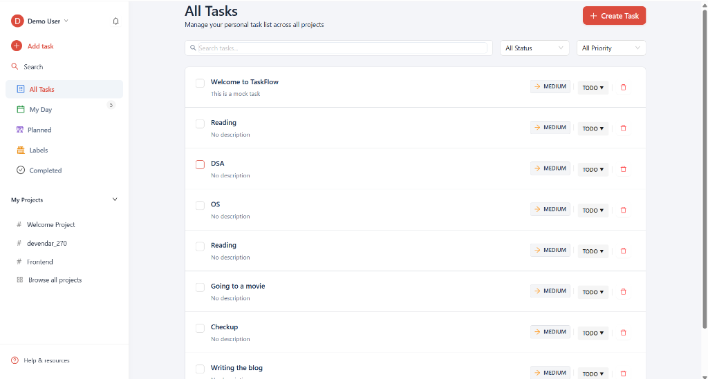
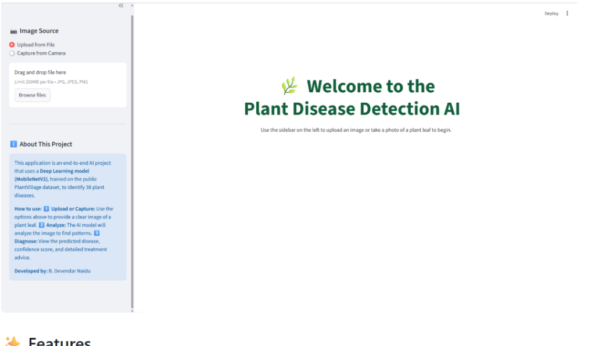
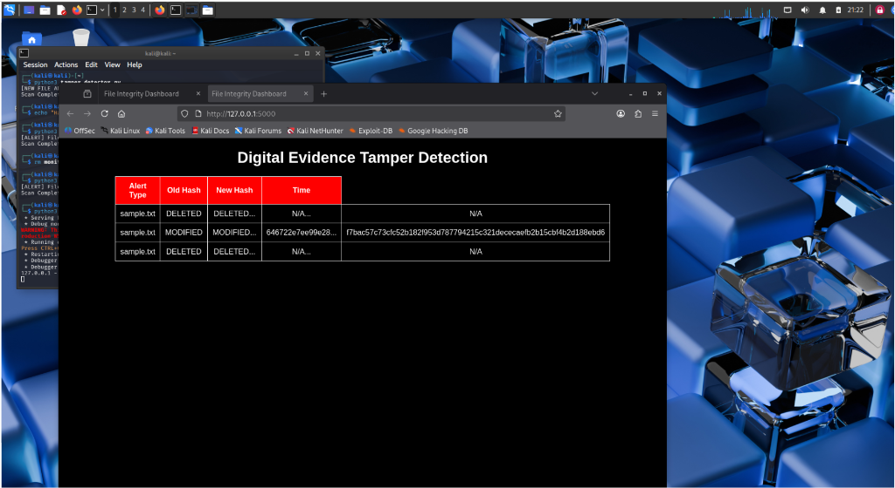

# Bandaru Devendar - Premium Developer Portfolio

A modern, production-ready developer portfolio website built using **React 19**, **Vite 8**, **TypeScript**, **Tailwind CSS v4** (using the new `@tailwindcss/vite` plugin), and **Framer Motion**.

The design is recruiter-friendly, responsive, supports smooth dark and light themes, features confetti triggers, and highlights technical architectures.

🔗 **Live Link:** [portfolio-three-beryl-p34hl5xw9i.vercel.app](https://portfolio-three-beryl-p34hl5xw9i.vercel.app/)

## 🚀 Key Features

1. **Modern Asymmetric Hero Section**: Features custom typing effects, glowing hover effects, profile avatar, and instant resume download / external profiles links.
2. **About Me**: Academics at KLH University, B.Tech CSE (3rd Year) details, location markers, and key interests.
3. **Animated Skills Grid**: Dynamic tab-based filtering across categories (Languages, Frontend, Backend, Database, Cloud & Tools, AI, and Others) with animated progress bars.
4. **Professional Timeline**: Vertical timeline charting the internship experience at Pinnacle Labs.
5. **Detailed Projects Section**:
   - **TaskFlow (Task Manager)**: Includes screenshot slider, tech badges, live link, code repository link, and an *interactive System Architecture Flowchart*.
   - **Plant Disease AI (Deep Learning)**: Includes screenshot slider, code repository link, and an *interactive AI Diagnosis pipeline diagram*.
   - Dual video-preview popup modals with fail-safe visual warnings.
6. **Certifications credentials**: Professional grids displaying Microsoft, AWS, IBM, and Cisco credentials with custom verify badges and links.
7. **Curriculum Vitae Preview**: A high-fidelity CSS-styled preview resume card that mimics a printed CV, complete with a PDF download link.
8. **Validating Contact Form**: Custom form validation with loading spin states and a *canvas-confetti particle burst* upon successful message delivery.
9. **Meet the Developer Section**: Special circular framed photo at the bottom of the page displaying a custom signature quote.
10. **Site-wide dark / light mode toggle** with smooth spring-loaded rotations, sticky navigation section tracking, and back-to-top integrations.
## 📸 Project Previews

### 1. TaskFlow - Full Stack Task Management System
TaskFlow offers group and user controls with custom status filter boards and label tags. Below is a preview of the **Filters & Labels** view (`/filters-labels`):



### 2. Plant Disease Detection AI
Using deep learning classifiers, the application accepts leaf uploads and returns diagnosis and treatment recommendations:



### 3. Digital Evidence Tamper Detection System (Kali Linux)
A lightweight forensics system designed to detect modifications and deletions of files using SHA-256 cryptographic hashing in Kali Linux:



---

## 🛠️ Folder Structure

```text
public/
  ├── favicon.svg
  ├── resume.pdf                # Replace this with your actual Resume PDF!
  ├── images/
  │   ├── profile/
  │   │   └── devendar.png       # Professional profile photo (already generated!)
  │   └── projects/
  │       ├── taskflow/         # Screen captures for TaskFlow
  │       └── plant-disease/    # Screen captures for Plant Disease AI
  └── videos/
      ├── taskflow-demo.mp4     # Demonstration screen captures
      └── plant-demo.mp4
src/
  ├── components/
  │   ├── Navbar.tsx
  │   ├── ThemeToggle.tsx
  │   ├── Hero.tsx
  │   ├── About.tsx
  │   ├── Skills.tsx
  │   ├── Experience.tsx
  │   ├── Projects.tsx
  │   ├── VideoModal.tsx
  │   ├── ArchitectureDiagram.tsx
  │   ├── WorkflowDiagram.tsx
  │   ├── Certifications.tsx
  │   ├── Resume.tsx
  │   ├── Contact.tsx
  │   ├── Testimonials.tsx
  │   ├── MeetDeveloper.tsx
  │   └── Footer.tsx
  ├── context/
  │   └── ThemeContext.tsx      # Dark / Light theme provider
  ├── data/
  │   └── portfolioData.ts      # Edit this file to update any text/skills/data!
  ├── hooks/
  │   └── useTheme.ts           # Simple theme toggler hook
  ├── App.tsx                   # Assembler
  ├── index.css                 # Tailwind v4 configuration and global rules
  └── main.tsx                  # Vite entrypoint
```

---

## 💻 Local Development

### 1. Install dependencies
```bash
npm install
```

### 2. Run local development server
```bash
npm run dev
```
Open [http://localhost:5173](http://localhost:5173) in your browser.

### 3. Verify Code Linting
```bash
npm run lint
```

### 4. Build for Production
```bash
npm run build
```

---

## ✏️ Customization Guide

All personal metadata, experiences, skills, projects, and certifications are stored centrally in a single file to keep the code dry and modular.

To change any information on the site, simply open:
👉 **[src/data/portfolioData.ts](file:///c:/Users/deven/OneDrive/Documents/Desktop/portfolio/src/data/portfolioData.ts)**

Edit the text fields, arrays, or numbers. The UI will automatically update.

---

## 🌐 Production Deployment

The project is fully compatible with standard React/Vite build rules. You can host it on Vercel, Netlify, or GitHub Pages.

### Deploying to Vercel (Recommended)
1. Commit and push your code to GitHub.
2. Go to [Vercel](https://vercel.com/) and click **Add New Project**.
3. Import your GitHub repository.
4. Keep the default settings (Vercel automatically detects Vite + React project rules).
5. Click **Deploy**. Your site will be live on a secure HTTPS link in less than a minute.
